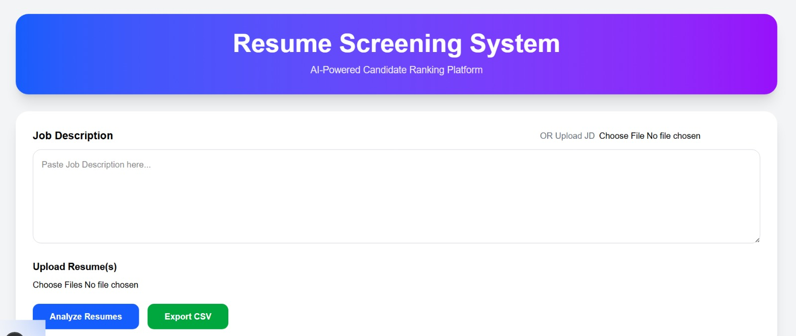
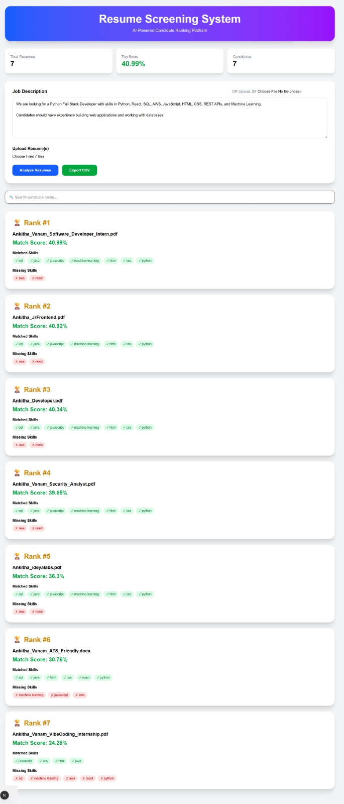

# Resume Screening System

AI-Powered Resume Screening and Candidate Ranking Web Application

## Overview

Resume Screening System is a full-stack web application that automates the initial candidate screening process by comparing uploaded resumes against a Job Description (JD).

The system analyzes resumes, calculates a matching score, identifies matching and missing skills, and ranks candidates from highest to lowest suitability.

---

## Features

### Resume Upload
- Upload single or multiple resumes
- Supports:
  - PDF
  - DOCX

### Job Description Input
- Enter Job Description manually
- Upload Job Description file

### Resume Analysis
- Resume text extraction
- Job Description analysis
- Skill matching
- Candidate scoring
- Candidate ranking

### Results Dashboard
- Candidate Name
- Match Score
- Rank
- Matched Skills
- Missing Skills

### Additional Features
- Search candidates
- Export results to CSV
- Database integration

---

## Tech Stack

### Frontend
- Next.js
- TypeScript
- Tailwind CSS
- Axios

### Backend
- FastAPI
- Python

### Database
- SQLite
- SQLAlchemy

### AI / Processing
- TF-IDF Vectorization

- Cosine Similarity

- Keyword Matching

---

## System Workflow

1. Upload Resume(s)

2. Enter or Upload Job Description

3. Analyze Resume Content

4. Compare Resume with JD

5. Generate Match Score

6. Rank Candidates

7. Display Results Dashboard

---

## Project Structure

```text
resume-screening-app/

├── frontend/
│   ├── app/
│   ├── public/
│   └── package.json
│
├── backend/
│   ├── main.py
│   ├── parser.py
│   ├── scorer.py
│   ├── database.py
│   ├── models.py
│   ├── uploads/
│   └── requirements.txt

|---- Screenshots/
     |-- Empty_DashBoard.png
     |-- Results_DashBoard.png
     
|
|
│
└── README.md
```

---

## Scoring Method

The application evaluates resumes using:

### Skills Matching
Checks whether required skills from the Job Description are present in the resume.

### Keyword Similarity
Uses TF-IDF Vectorization and Cosine Similarity to measure textual similarity between the Job Description and resume content.

### Final Score
A combined score is generated based on:

- Skill Match Percentage
- Keyword Similarity Score

Score Range:

```text
0 - 100%
```

Higher scores indicate better alignment with the Job Description.

---

## Database

Candidate analysis results are stored in SQLite database.

Stored Information:

- Candidate Name

- Match Score

- Matched Skills

- Missing Skills

---

## Installation

### Clone Repository

```bash
git clone <repository-url>
cd resume-screening-app
```

### Backend Setup

```bash
cd backend

python -m venv venv

venv\Scripts\activate

pip install -r requirements.txt

uvicorn main:app --reload
```

Backend runs at:

```text
http://127.0.0.1:8000
```

---

### Frontend Setup

```bash
cd frontend

npm install

npm run dev
```

Frontend runs at:

```text
http://localhost:3000
```

---


## Screenshots

### Empty Dashboard



### Results Dashboard




- Authentication & Login

- Resume Preview

- Advanced AI Scoring

- Interview Recommendation System

- Candidate Analytics Dashboard

- Cloud Database Integration

---

## Deployment

### Frontend
- Vercel

### Backend
- Render

